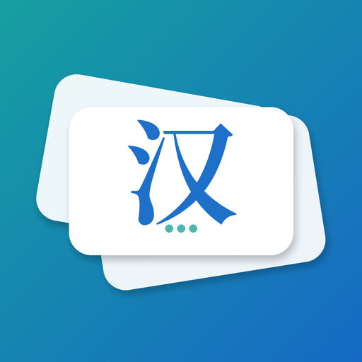

<h1 align="center">
  
   
  CardPop
</h1>

<h3 align="center">Passive learning with your phone! 📱</h3>

> **This is a fork of [FloFla Cards](https://github.com/flofladev/floflacards) by [flofladev](https://github.com/flofladev).**  
> The original idea and base implementation are theirs. Using Claude, I implemented significant new features on top of their work.

## What is CardPop?

CardPop helps you learn **passively** while using your phone. Flashcards will appear on top of other apps at intervals you choose – so you can memorize words, formulas, or definitions while scrolling, chatting, or browsing.No extra effort. Just daily learning in the background.

### With CardPop, you can: 
- Learn new words daily while scrolling social media 
- Revise definitions before a test 
- Practice foreign languages without opening a book 
- Build your own library of flashcards for any subject

### Perfect for: 
- Students and high schoolers preparing for exams 
- Language learners who want to expand vocabulary 
- Anyone who wants tolearn on the go

### Why CardPop? 
- Unlike other flashcard apps, CardPop **doesn’t** require you to open it every time. It gently reminds you of what you want to learn while you’re already using your phone. Simple,effective, and distraction-free.📌 
- Privacy first: CardPop works fully offline. We do notcollect, store, or share any personal data. No ads, no analytics, no hidden costs – just learning. Start learning passively today and turn your screen time into studytime! 🚀

## Features
- 📂 Create your own categories and flashcards
- ⏰ Set the interval for how often cards appear
- 📐 Adjust the size and opacity so they don’t disturb you
- 🔒 100% offline – no internet, no accounts, no data collection
- 💡 Learn languages, prepare for exams, or memorize anything
- 🎉 Completely free, no ads, no tracking

### Added in this fork
- 🧠 **FSRS v6 spaced repetition** — cards are scheduled using [FSRS](https://github.com/open-spaced-repetition/fsrs4anki), the algorithm that powers the newest Anki scheduler. Intervals adapt to your performance, with configurable target retention (80–95 %, default 90 %).
- 📦 **Anki import** — import `.apkg` decks from Anki Web
- 📊 **More statistics** — review history chart (last 30 days) and rating distribution chart
- 💾 **Backup includes settings** — every card change is immediately backed up as a JSON file (including app settings) via Android’s Storage Access Framework
- 😴 **Snooze** — pause the overlay for a configurable number of minutes
- 🚫 **App blocklist** — suppress the overlay while specific apps are in the foreground
- 🔍 **Pleco lookup** — tap a button on the overlay to look up the front side in the Pleco dictionary app
- 🖋️ **Custom question font** — load any TTF or OTF font file from your device (Settings → Flashcard Font → Load font file). Applied to the flashcard question only; the answer always uses the system font. Suggestions for Chinese study:
  - **LXGW WenKai** — open-source 楷书 font, available at [github.com/lxgw/LxgwWenKai](https://github.com/lxgw/LxgwWenKai/releases) (SIL OFL 1.1 license)
  - **Gukai** — the handwriting font bundled with the [Hanping Chinese Dictionary](https://hanping.app/) app; extract it from the APK and load it here
- 🌍 **Translations** — English, Polish, German

---
## License
This project is licensed under the GNU General Public License v3.0.

<b>Click here to see the license</b>

 

[License](https://github.com/flofladev/floflacards/blob/main/LICENSE)

